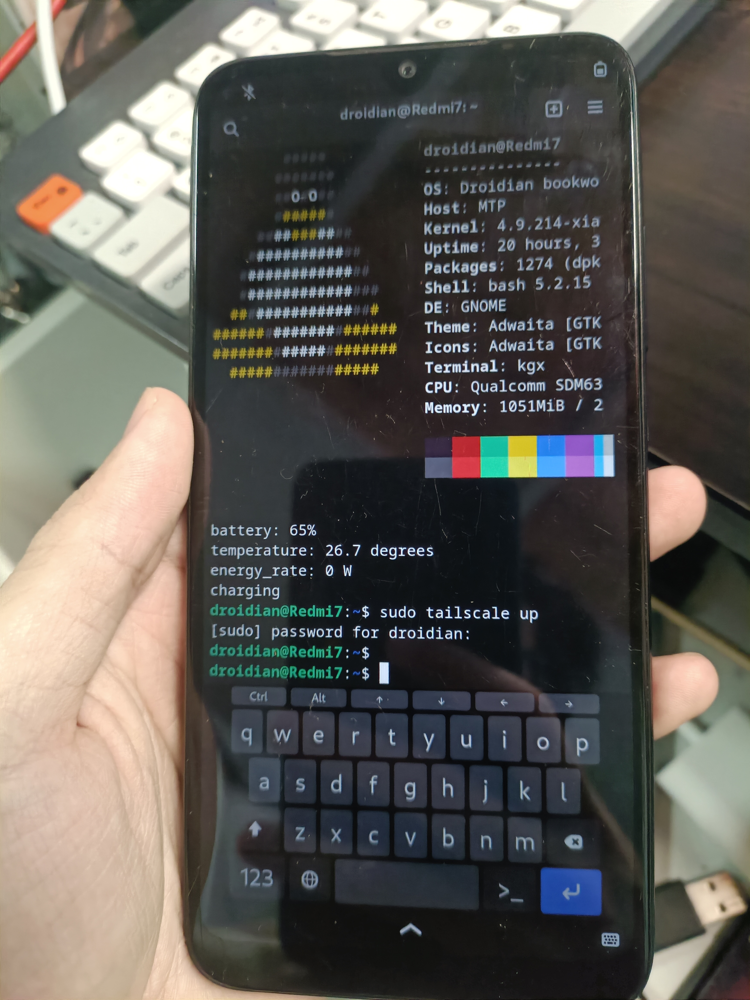

# make my linux server on Redmi 7
* make sure your are in Droidian (based on Debian 12) and your username is droidian.  
<code>sudo  sed  s/ID=*^/ID=debian/ /etc/os-release  #your are debian now</code>  
<code>echo VERSION_CODENAME="bookworm" >> os-release #and you are bookworm  </code>
* remove useless sources   
<pre>sudo rm /etc/apt/sources.list.d/oncl*  
sudo rm /etc/apt/sources.list.d/batman.list  
sudo rm /etc/apt/sources.list.d/mobian.sources  </pre>
## showcase
* 
* 
## install something
<pre>
sudo apt update  
sudo apt install -y btop neofetch  
sudo apt install -y openjdk-17-jdk  
sudo apt install -y curl wget tar zip unzip screen  
sudo apt install -y python3-pip  
sudo apt update  
sudo apt install -y python3.11-venv  
</pre>
## get tailscale
<code>cd --</code>  
<code>sudo curl -fsSL https://tailscale.com/install.sh | sh </code>  
<code>tailscale up  </code>

## get docker and 1panel
<pre>sudo apt-get install -y ca-certificates
sudo install -m 0755 -d /etc/apt/keyrings
sudo curl -fsSL https://download.docker.com/linux/debian/gpg -o /etc/apt/keyrings/docker.asc
sudo chmod a+r /etc/apt/keyrings/docker.asc
</pre>
<pre>
echo \
  "deb [arch=$(dpkg --print-architecture) signed-by=/etc/apt/keyrings/docker.asc] https://download.docker.com/linux/debian \
  $(. /etc/os-release && echo "$VERSION_CODENAME") stable" | \
  sudo tee /etc/apt/sources.list.d/docker.list > /dev/null
</pre>
<pre>
sudo apt-get update
sudo apt-get install docker-ce docker-ce-cli containerd.io docker-buildx-plugin docker-compose-plugin</pre>
<pre>sudo curl -sSL https://resource.fit2cloud.com/1panel/package/quick_start.sh -o quick_start.sh && sudo bash quick_start.sh</pre>
* now you can visit then in your 1panel website with tailscale ip  
## make some charging strategy
<pre>sudo apt install -y upower cron </pre>
<pre>mkdir sh  </pre>
<pre>cd sh </pre> 
<code>nano charge</code>  
put it in  
<pre>#!/bin/bash

BATTERY_INFO=$(upower -i /org/freedesktop/UPower/devices/battery_battery)

BATTERY_STATE=$(echo "$BATTERY_INFO" | grep -E "state" | awk '{print $2}')

BATTERY_PERCENTAGE=$(echo "$BATTERY_INFO" | grep -E "percentage" | awk '{print $2}' | tr -d '%')

if [[ "$BATTERY_STATE" == "charging" && "$BATTERY_PERCENTAGE" -gt 90 ]]; then
    echo 1 > /sys/class/power_supply/battery/input_suspend
#    echo 0 > /sys/class/power_supply/battery/charging_enabled
fi

if [[ "$BATTERY_STATE" == "discharging" && "$BATTERY_PERCENTAGE" -lt 40 ]]; then
    echo 0 > /sys/class/power_supply/battery/input_suspend
#    echo 1 > /sys/class/power_supply/battery/charging_enabled
fi
</pre>
<code>sudo chmod +x charge  
sudo chmod 777 charge</code>  
<code>sudo crontab -e  </code>  
put it in  
<code> 10/* * * * * /bin/bash /home/droidian/sh/charge
</code>
* now you can charge it and it will stop when get 90% and start at 40%.

## make my customezation
<code>cd /home/droidian/sh</code>  
<code>nano info </code>  
add then  
<pre>#!/bin/bash

BATTERY_INFO=$(upower -i /org/freedesktop/UPower/devices/battery_battery)
BATTERY_PERCENTAGE=$(echo "$BATTERY_INFO" | grep -E "percentage" | awk '{print $2}')

BATTERY_TEMPERATURE=$(echo "$BATTERY_INFO" | grep -E "temperature" | awk '{print $2, $3}')
BATTERY_STATE=$(echo "$BATTERY_INFO" | grep -E "state" | awk '{print $2}')
BATTERY_RATE=$(echo "$BATTERY_INFO" | grep -E "energy-rate" | awk '{print $2}')
echo "battery: $BATTERY_PERCENTAGE"
echo "temperature: $BATTERY_TEMPERATURE"
echo "energy_rate: $BATTERY_RATE W"
echo $BATTERY_STATE

</pre>
<code>nano .bashrc</code>  
add then  
<pre>
export PATH=$PATH:/home/droidian/sh
clear
neofetch
info
</pre>
